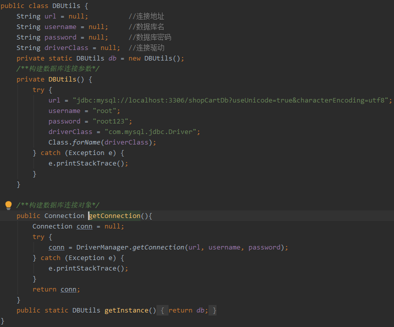

简易购物车项目简介
=
1.项目开发准备:
-----
1. 创建github仓库
2. 项目框架搭建
3. 项目构建并同步仓库
4. 编写所需业务逻辑

2.开发项目解决方案:
-----
1. github仓库站上所属存放的项目仓库
2. mysql数据库中创建项目所需shopCartDB数据库，用于储存购物车项目所需数据
4. 采用注解@WebServlet进行http请求响应
3. 搭建jsp+servlet架构的技术框架，基于c标签及el表达式进行jsp页面数据渲染,
c标签引入方式：
```diff
<%@ taglib prefix="c" uri="http://java.sun.com/jsp/jstl/core" %>
```
 根据jdbc直连技术，编写数据库操作工具类，方便存储数据，代码如下：
  


3.项目内容:
-----
1.  注册
2.  登录
3.  找回密码
4.  商品列表
5.  添加购物车
6.  购物车删除
7.  购物车数量修改
8.  购物车结算

4.项目总结:
-----
1. jsp+servlet组合框架开发，条理清晰的mvc框架
2. 了解c标签进行数据渲染及多方面的强大渲染能力，可以更合理动态展示复杂的数据结构
3. 丰富学习了markdown扩充的语法,可以更直观展示项目介绍文档
4. 合理利用jdbc直连技术，更加熟悉掌握对数据的增删改查操作
5. 巩固java的基础知识，并针对不足之处记性额外补充学习，比如list结构及数组结构体的运用
6. 熟悉ajax技术，能利用ajax技术针对get与post请求进行数据的传递和响应

